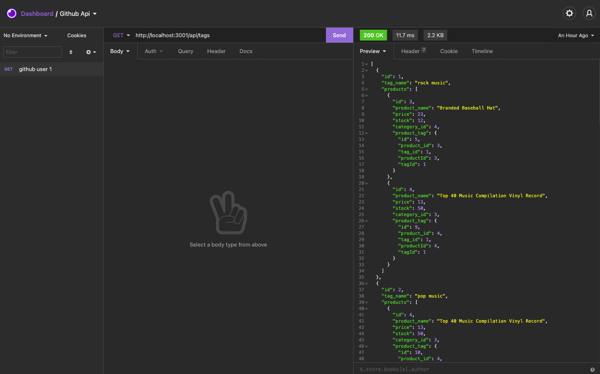
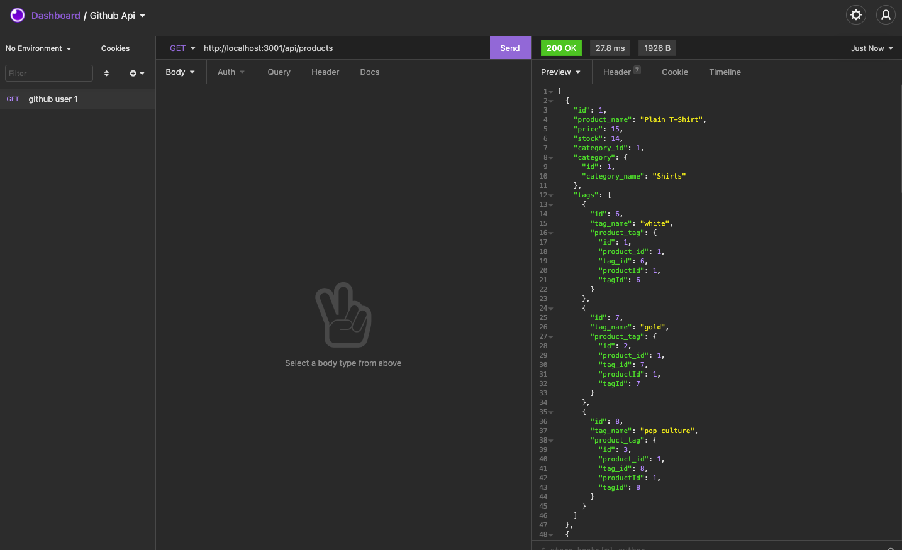
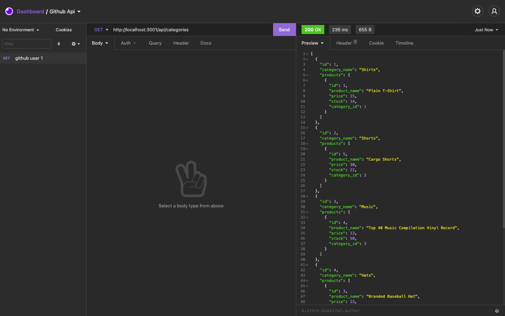

# E-Commerce-Back-End

## Table of Content 
* [Description](#description)
* [Technologies](#technologies)
* [Usage](#usage)
* [Contributing](#contributing)
* [Testing](#testing)
* [Questions](#questions)
* [License](#license)

## Description
Online shopping has blown up in the past years to becoe the dominant form of retail. As such, its improtant that those running these online shops can have relaible access to the stocks available for them to sell.  This app uses express, mysql and sequelise to bring about this information. This app will allow users to document the catalogue of products avaialble with information that is updatable and easily identifiable using several descriptive searches.

## Technologies
JavaScript, Node JS, Express, MYSQL, Sequelize, 

## Usage

This video gives a run through of the app
https://watch.screencastify.com/v/RZls4yAdgwPklNRoW1vZ

Load the MySQL and Sequelize packages to connect your Express.js API to a MySQL database 
Sensitive Data is stored in dotenv file to protect user info
Use the `schema.sql` file to create your database with MySQL shell commands.
When the comman is entered, the server is started and the Sequelize models are synced to the MySQL database
Once run, Use Insomnia to view routes for categories, products, or tags
Then using POST, PUT, and DELETE routes in Insomnia Core, users can create, update, and delete data in the database

## Contributing
Project can be accesed here - https://github.com/konnenhannaford/E-Commerce-Back-End

Repo is Public so freely available using MIT Licence. 

## Testing
No testing information as of yet

## Questions
Contact me if you have any queries:

Github UserName - konnenhannaford

Github Profile - https://github.com/konnenhannaford

Contact me for further info and any questions

Email - konnen23@gmail.com

## License
MIT license
Copyright 2021 Read Me Generator